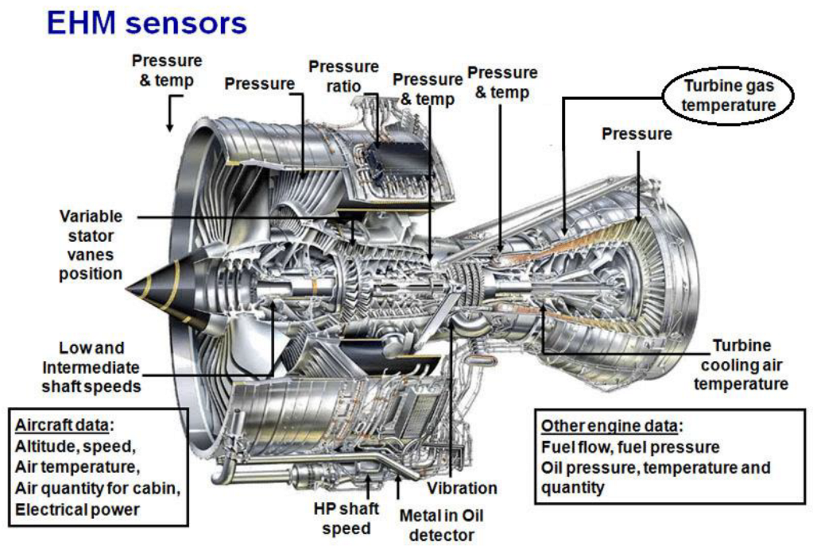

# ✈️ Predictive Maintenance for Aircraft Engines

An intelligent predictive maintenance system using NASA's CMAPSS dataset to forecast turbofan engine failures. By analyzing sensor data, it predicts the **Remaining Useful Life (RUL)** of engines, enabling safer, cost-effective, and timely maintenance decisions.



---

## 🚀 Live Demo

Try the live app here:  
[](https://predictive-maintenance-depi.streamlit.app/)

---

## 📌 Project Overview

This system is designed to:

- 📅 Enable **proactive maintenance scheduling**
- 🛠️ Reduce **unplanned downtime by 30–50%**
- 📦 Improve **spare parts inventory management**
- ✈️ Enhance **flight safety metrics**

We use machine learning to detect early signs of wear, failure, or anomalies based on rich multi-sensor data collected from jet engines during operation.

---

## 📚 Dataset Details (CMAPSS)

The system uses NASA’s **Turbofan Engine Degradation Simulation Dataset**. The dataset includes:

### 1. Engine Metadata:
- `unit_number`: Unique engine ID
- `time_cycles`: Total operating cycles

### 2. Operational Settings:
- `altitude`, `mach_number`, `throttle_resolver_angle`

### 3. Thermal Monitoring:
- `fan_inlet_temp`, `LPC_outlet_temp`, `HPC_outlet_temp`
- `compressor_discharge_temp`, `HPT_outlet_temp`, `LPT_outlet_temp`

### 4. Pressure Analysis:
- `fan_inlet_pressure`, `bypass_duct_pressure`, `HPC_outlet_pressure`, etc.

### 5. Mechanical Performance:
- `physical_fan_speed`, `corrected_core_speed`

> **All values are measured in:**
> - Temperatures: °C  
> - Pressure: PSI  
> - Speed: RPM

---

## 🩺 Diagnostic Indicators

| Symptom | Possible Issue |
|--------|----------------|
| 🔥 High Temperature Deviations | Cooling system failure |
| 💨 Pressure Anomalies         | Airflow blockages       |
| 🔄 Speed Fluctuations         | Mechanical wear         |
| 🔥 Ratio Variations           | Combustion inefficiencies |

---

## 🧠 Machine Learning Pipeline

### 🔧 Preprocessing:
- Normalization  
- Trend extraction  
- Sensor data fusion

### 🧮 Algorithms:
- LSTM (Recurrent Neural Network)
- Survival Analysis
- Gradient Boosting Machines

### 🎯 Outputs:
- RUL prediction  
- Failure probability  
- Alert thresholds

---

## ✅ Key Benefits

- 🔧 25–40% reduction in maintenance cost  
- 🕵️‍♀️ 60% better early fault detection  
- 📡 Real-time monitoring compatible  
- ⚙️ Adaptable to various engine types

---

## 🧪 Getting Started

To set up and run this project on your local machine:

### 1️⃣ Clone the repository:

```bash
git clone https://github.com/KarimXHamed/PredictiveMaintenance.git
cd predictive-maintenance
```

### 2️⃣ Create and activate the virtual environment (using conda):

```bash
conda env create -f environment.yml
conda activate predictive-maintenance
```

> Replace `predictive-maintenance` with your actual environment name if different.

### 3️⃣ Pull data and models using DVC:

Make sure DVC is installed:

```bash
pip install dvc
dvc pull
```

This will download the required dataset and trained model files.

### 4️⃣ Run the training or prediction script:

```bash
python train_model.py
# OR
python predict_rul.py
```

---

## 📦 Dependencies

All dependencies are listed in the `environment.yml` file.  
You can inspect or customize them there.

---

## 📂 Project Structure

```
predictive-maintenance/
│
├── data/                 # Raw & preprocessed data (DVC-tracked)
├── models/               # Trained model files (DVC-tracked)
├── images/               # Images used in README or dashboard
├── train.ipynb           # Main training notebook
├── dashboard.py          # Streamlit dashboard app
├── environment.yml       # Conda environment configuration
├── dvc.yaml              # DVC pipeline configuration
├── README.md             # Project documentation
├── mlruns/               # MLflow experiment tracking (optional)
└── ...
```


---

## 🤝 Contributions

Pull requests are welcome.  
For major changes, please open an issue first to discuss what you would like to change.
